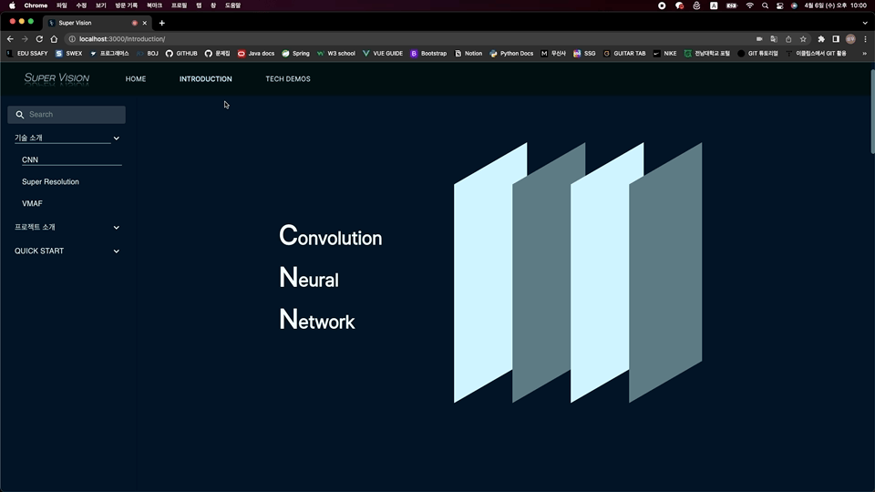
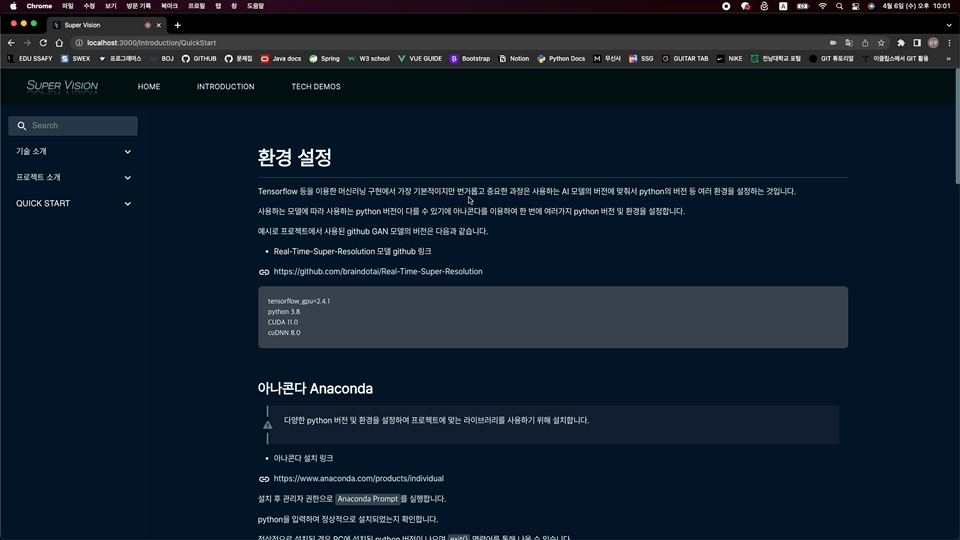

# 시연 시나리오

1. 메인 페이지
    1. 슬라이드
        1. 하단의 슬라이드로 화질차이를 보여준다. 마우스를 좌우로 움직이며 화질을 비교하여 우리 서비스를 직관적으로 보여준다.
    
    
    
2. 필터 체험
    1. ImageFilter
        1. Image Filter by Upload 
            1. 이미지를 넣고 드래그로 크롭할 영역을 지정한 후 필터링을 한다. 일반 필터와 AI 필터를 VMAF 점수와 돋보기로 비교한다.
            
            
            
        2.  Image Filter by Detect
            1. 여러 사람이 찍힌 이미지를 넣고, 이미지에서 자동으로 객체를 추출한 후 디텍딩된 인물들 중 하나를 골라 머리카락, 옷의 무늬 등을 중심으로 비교한다.
    
    
    
    2. WebcamFilter
       1. 웹캠으로 실시간으로 AI 필터가 적용된 모습을 돋보기를 사용해 일반 필터와 비교한다. 웹캠을 키고 머리카락, 옷의 체크무늬 등을 중심으로 확대해서 비교한다.
    
    
    
3. 소개 페이지
    1. 기술 소개
       
        1. CNN, Super Resolution, VMAF 기술 간략하게 소개한다.
        
        
        
    2. 프로젝트 소개
    
        1. 우리의 서비스 Super Vision을 만든 이유를 소개한다.
    
    3. Quick Start
    
        1. AI 필터링을 개발자가 따라할수 있는 매뉴얼 Quick Start를 소개한다.
    
        